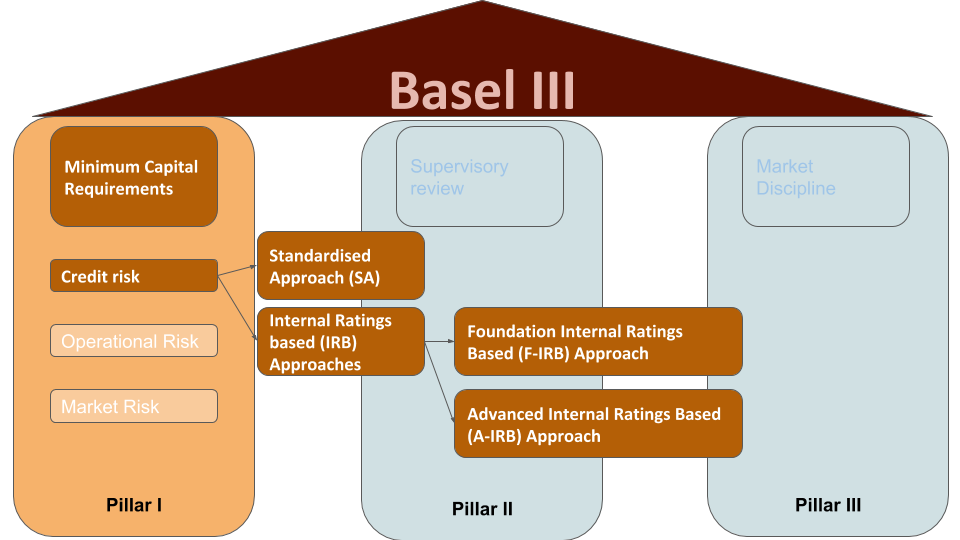
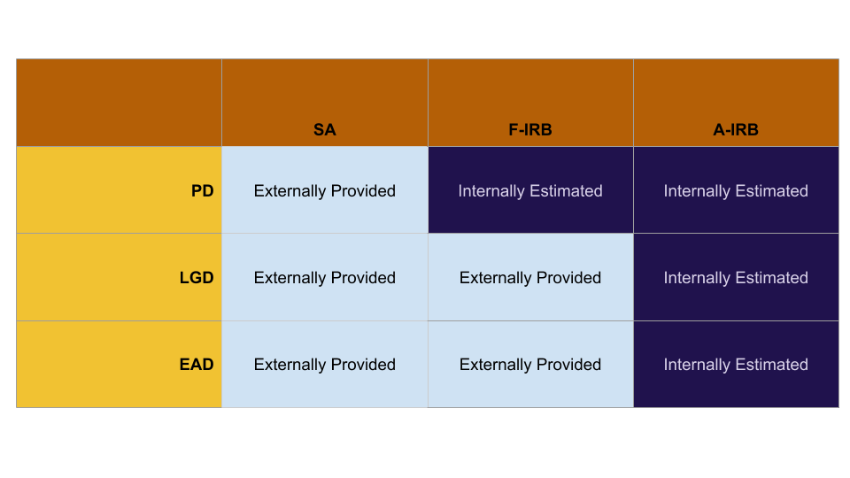

# Credit Risk Model with Python

## Objective
This Repository collects the end-to-end application of Credit Risk models for Banks based on Basel III standards. 

The Repository demonstrates the Probability of Default (PD), Loss Given Default (LGD) and Exposure at Default (EAD) calculations including data preprocessing, feature selection, modelling, model validation and monitoring. 

## Dataset
The dataset contains all available data for more than 800,000 consumer loans issued from 2007 to 2014 by Lending Club: a large US peer-to-peer lending company. There are several different versions of this dataset. I have used a version available on kaggle.com.

Project is based on the udemy course "Credit Risk Modelling in Python 2020".

